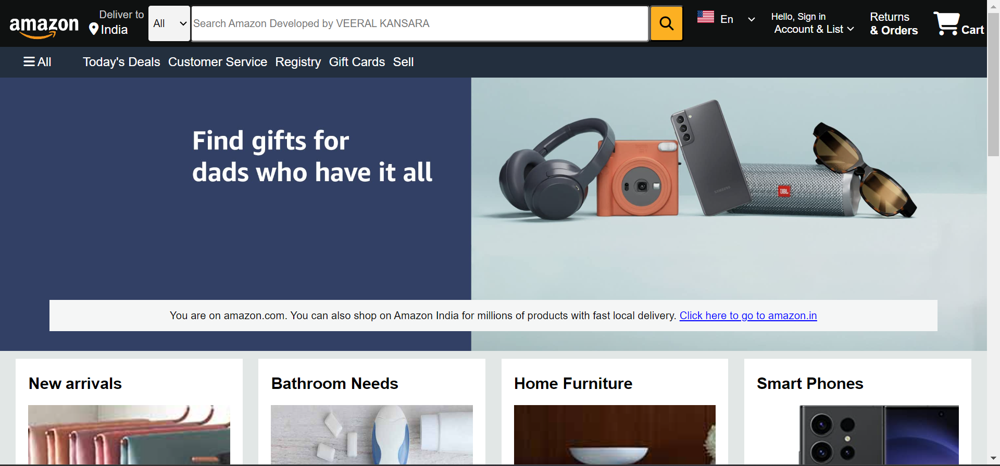
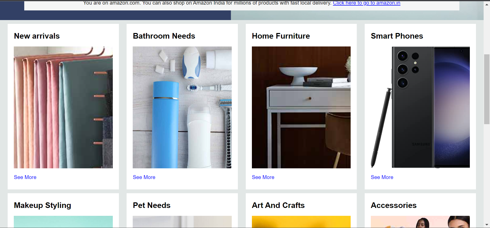
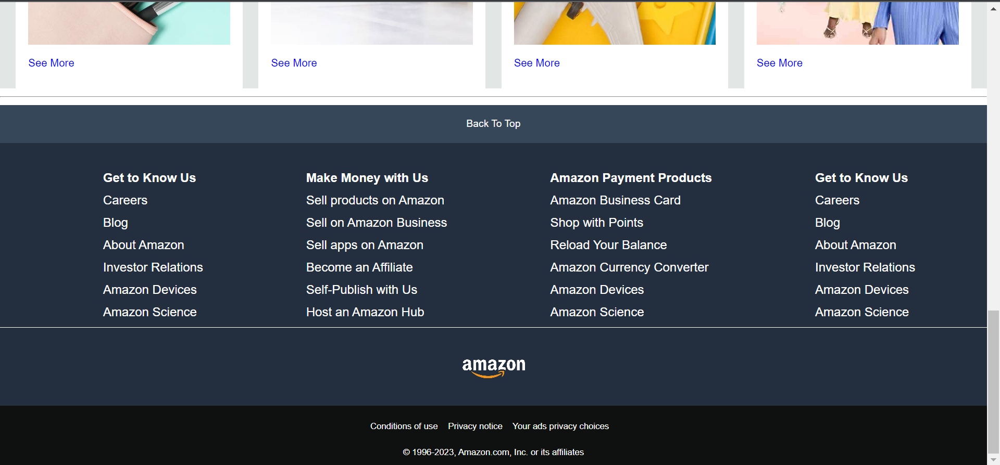

# Amazon.com Clone



## Description

The Amazon.com Clone project is a front-end web development project that replicates the user interface of the popular e-commerce website, Amazon. This project aims to demonstrate web development skills by recreating the look and feel of the Amazon website using HTML and CSS.

## Features

- **Homepage:** A faithful reproduction of the Amazon homepage, including the Amazon logo, navigation menu, and product listings.

- **Product Listings:** Displays various product listings with product images, titles, prices, and ratings.

- **Responsive Design:** The project is responsive, ensuring that it looks good and functions well on various screen sizes and devices.

## Technologies Used

- **HTML5:** Used for structuring the web page content.

- **CSS3:** Used for styling and layout.

## Screenshots




## Installation

To view this project locally, follow these steps:

1. Clone the repository:

   ```bash
   git clone https://github.com/your-username/amazon-clone.git
   Open the project directory:
   cd amazon-clone
   Open the index.html file in your web browser.
   ```

Usage
You can navigate through the project to explore the Amazon-like user interface and product listings.

Contributing
Contributions to enhance the project or fix issues are welcome! To contribute:

Fork the repository.

Create a new branch:
git checkout -b feature/your-feature-name
Make your changes and commit them:
git commit -m 'Add some feature'
Push to your forked repository:
git push origin feature/your-feature-name

Certainly! Here's a README.md template for your Amazon.com clone project on GitHub:

markdown
Copy code

# Amazon.com Clone


## Description

The Amazon.com Clone project is a front-end web development project that replicates the user interface of the popular e-commerce website, Amazon. This project aims to demonstrate web development skills by recreating the look and feel of the Amazon website using HTML and CSS.

## Features

- **Homepage:** A faithful reproduction of the Amazon homepage, including the Amazon logo, navigation menu, and product listings.

- **Product Listings:** Displays various product listings with product images, titles, prices, and ratings.

- **Responsive Design:** The project is responsive, ensuring that it looks good and functions well on various screen sizes and devices.

## Technologies Used

- **HTML5:** Used for structuring the web page content.

- **CSS3:** Used for styling and layout.

## Screenshots


## Installation

To view this project locally, follow these steps:

1. Clone the repository:

   ```bash
   git clone https://github.com/your-username/amazon-clone.git
   Open the project directory:
   ```

bash
Copy code
cd amazon-clone
Open the index.html file in your web browser.

Usage
You can navigate through the project to explore the Amazon-like user interface and product listings.

Contributing
Contributions to enhance the project or fix issues are welcome! To contribute:

Fork the repository.

Create a new branch:

bash
Copy code
git checkout -b feature/your-feature-name
Make your changes and commit them:

bash
Copy code
git commit -m 'Add some feature'
Push to your forked repository:

bash
Copy code
git push origin feature/your-feature-name
Create a pull request on the original repository.

License
This project is open-source and available under the MIT License. Feel free to use, modify, or distribute it as needed. - Veeral Kansara

Contact
If you have any questions or suggestions, please feel free to contact me at vkveeral@gmail.com

Happy coding!
